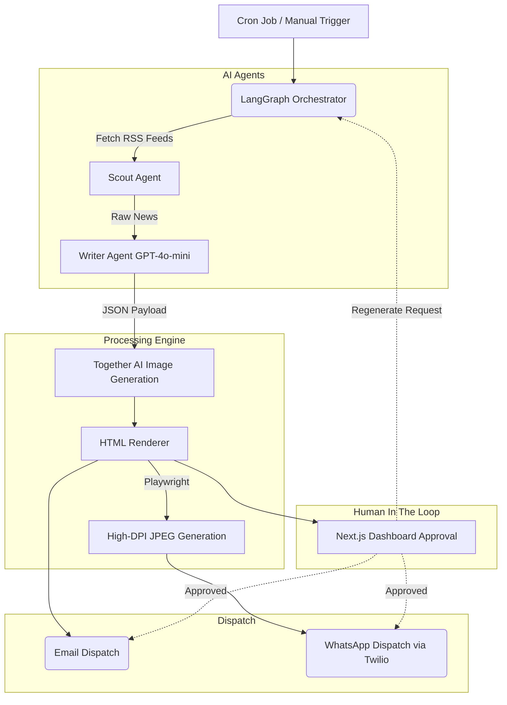

# 🚀 INKER Newsletter Automation Platform


**INKER** is an enterprise-grade AI automation platform designed to curate, generate, review, and dispatch highly engaging technology newsletters. 

Built with an intelligent multi-agent orchestrator (LangGraph), the platform reads live RSS feeds, curates high-signal tech news, and automatically drafts distinct demographic-targeted editions (e.g., Student Edition & Faculty Edition). It features a robust review dashboard and dispatches final outputs across Email and WhatsApp.

---

## ✨ Key Features

- 🧠 **AI Multi-Agent Pipeline**: Utilizes LangGraph and GPT-4o-mini for intelligent scouting, curation, and writing.
- 🎯 **Dual-Demographic Generation**: Simultaneously creates tailored content for different audiences (Students & Faculty).
- 🎨 **Dynamic AI Imagery**: Uses Together AI (FLUX.1) to generate bespoke, cinematic thumbnails for each news item.
- 📱 **Omnichannel Dispatch**: Automatically renders ultra-high DPI mobile-optimized versions of newsletters via Playwright and dispatches them directly via Twilio (WhatsApp) and Email.
- 🖥️ **Modern Web Dashboard**: Next.js 16 frontend for seamless human-in-the-loop (HITL) review, editing, and approval of pending editions.
- ⏱️ **Cron Scheduling**: Fully automated background scheduling for specific publishing days.

---

## 🏗️ System Architecture



---

## 📂 Project Structure

```text
INKER/
├── backend/                  # FastAPI & LangGraph Engine
│   ├── config.py             # Environment configurations
│   ├── database.py           # SQLite / SQLAlchemy connection
│   ├── engine.py             # Core pipeline execution logic
│   ├── main.py               # FastAPI endpoints & webhooks
│   ├── models.py             # DB Schema definitions
│   ├── orchestrator.py       # LangGraph multi-agent flow
│   └── whatsapp_service.py   # Twilio integration
│
└── frontend/                 # Next.js Review Dashboard
    ├── app/                  # Next.js app router
    ├── next.config.ts        # Next.js configuration
    ├── tailwind.config.js    # TailwindCSS styling rules
    └── package.json          # Node dependencies
```

---

## ⚙️ Prerequisites

Before you begin, ensure you have the following installed on your machine:
- **Python 3.10+**
- **Node.js 18+**
- **Playwright** (installed via Python dependencies)

> [!WARNING]
> **API Billing Requirements**: This project currently utilizes **paid tiers** for its external services. The successor must ensure these accounts remain funded or migrate the keys to their own billing accounts.

You will also need active API keys for:
- [OpenAI](https://platform.openai.com/): Required for the GPT-4o-mini LLM agent orchestrator. **(Paid Tier)**
- [Together AI](https://www.together.ai/): Required for dynamic FLUX.1 image generation. **(Paid Tier)**
- [Twilio](https://www.twilio.com/): Required for dispatching messages via the WhatsApp API. **(Free / Sandbox Tier)**

---

## 🚀 Setup Instructions

### 1. Backend Setup (FastAPI)

Navigate to the backend directory and set up the Python environment:

```bash
cd backend
python -m venv venv

# Windows
venv\Scripts\activate
# Mac/Linux
source venv/bin/activate

# Install dependencies
pip install -r requirements.txt

# Install Playwright browsers (Required for WhatsApp Image rendering)
playwright install chromium
```

### 2. Frontend Setup (Next.js)

Navigate to the frontend directory:

```bash
cd frontend
npm install
```

---

## 🔐 Environment Variables

Create a `.env` file in the **root** of the `backend/` directory. Use the following template:

```env
# AI Models
OPENAI_API_KEY="your-openai-api-key"
TOGETHER_API_KEY="your-together-ai-api-key"

# Database
DATABASE_URL="sqlite:///./enterprise_platform.db"

# WhatsApp Provider Selection
WHATSAPP_PROVIDER="meta" # Options: "meta" or "twilio"

# Meta Official WhatsApp API (Recommended)
META_ACCESS_TOKEN="your-permanent-access-token"
META_PHONE_NUMBER_ID="your-phone-number-id"
META_RECIPIENT_NUMBER="target-phone-number-with-country-code"

# Twilio (Fallback/Sandbox)
TWILIO_ACCOUNT_SID="your-twilio-sid"
TWILIO_AUTH_TOKEN="your-twilio-auth-token"
TWILIO_WHATSAPP_SENDER="whatsapp:+14155238886"

# URLs & Security
BACKEND_URL="http://127.0.0.1:8000"
FRONTEND_URL="http://localhost:3000"
CORS_ORIGINS="http://localhost:3000,http://127.0.0.1:3000"
CRON_SECRET="optional-secret-for-cron-auth"
```

---

## 💻 Running the Application Locally

You need to run both the backend and frontend simultaneously. 

**Start the Backend Engine:**
```bash
cd backend
# Make sure your venv is activated
uvicorn main:app --reload --port 8000
```
*(The backend runs on `http://localhost:8000`)*

**Start the Frontend Dashboard:**
```bash
cd frontend
npm run dev
```
*(The frontend runs on `http://localhost:3000`)*

---

## ☁️ Cloud Deployment (Handover Notes)

If deploying to production, follow these recommended practices:

1. **Backend (Render / Railway / Heroku)**: 
   - Ensure the deployment environment supports **Playwright** (many platforms require a specific buildpack or Docker image for headless Chromium).
   - Use a persistent volume for SQLite (or migrate `DATABASE_URL` to a hosted PostgreSQL instance).
   - Command: `uvicorn main:app --host 0.0.0.0 --port $PORT`

2. **Frontend (Vercel)**:
   - Connect the GitHub repository directly to Vercel.
   - Set the `NEXT_PUBLIC_API_URL` environment variable to point to your live backend domain.
   - Build Command: `npm run build`

3. **Cron Jobs**:
   - Set up an external cron service (like GitHub Actions, cron-job.org, or Vercel Cron) to hit `POST /api/generate/scheduled` daily with the `X-Cron-Secret` header to trigger automated pipeline runs.

---

> **Note to future maintainers**: This project aggressively utilizes async AI generations. Monitor Twilio API limits (5MB max for WhatsApp media) and Together AI rate limits, which are currently caught and handled via fallback placeholders in `engine.py`.

---

## 🔮 Future Enhancements (Roadmap)

If you are picking up this project, here are the highest-impact features recommended for the next phase of development:

1. **Retrieval-Augmented Generation (RAG)**: 
   - Integrate a vector database (e.g., Pinecone or ChromaDB) to store internal company/university announcements.
   - Inject this internal knowledge into the LangGraph Writer agent so external tech news is directly contextualized against internal organizational goals.
2. **Full-Text Web Scraping**: 
   - Currently, the Scout agent relies on RSS summaries. Implementing a scraper (like BeautifulSoup or Playwright) to read the full source articles will allow the Writer agent to generate much deeper, faculty-level technical analysis.
3. **Historical Continuity**: 
   - Vectorize and store past newsletters. This allows the AI to reference past editions (e.g., *"Following up on our coverage of AI agents last week..."*), creating a more continuous and engaging reading experience.
